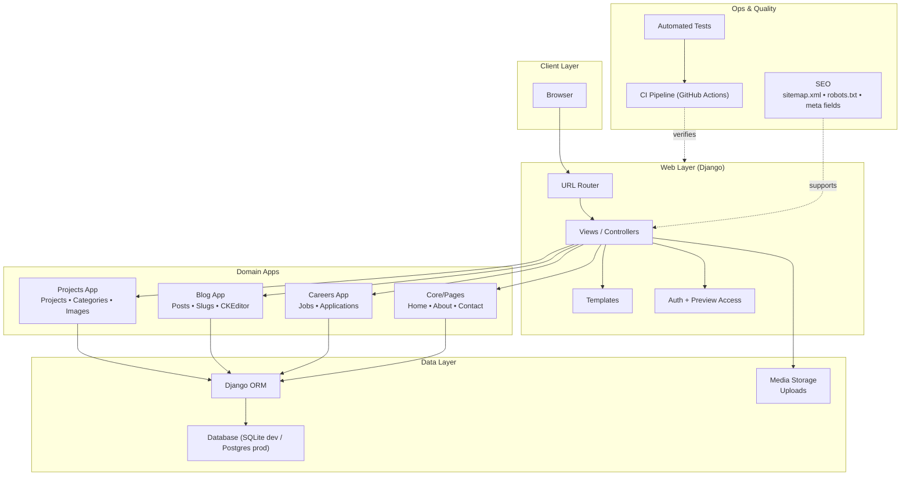

# ScriptOrbit — Django Platform

A production-style **Django web platform** powering Script Orbit’s public presence: portfolio projects, blog publishing, careers/job applications, and authenticated client preview flows. Built with clean app separation, SEO fundamentals, and CI-backed checks.

[](https://github.com/Shayanqw/scriptorbit-django-platform/actions)

**Live:** https://www.scriptorbit.com/

---

## Highlights

- **Projects portfolio** with categories and media assets
- **Blog publishing** with slug routing and rich text (CKEditor)
- **Careers & job applications** workflow
- **Auth-protected client previews** (gated preview templates/pages)
- **SEO foundations** (`sitemap.xml`, `robots.txt`, meta fields)
- **Automated tests + CI** to prevent regressions

---

## Architecture



---

## Tech Stack

- **Python**, **Django**
- Server-rendered templates (HTML/CSS/JS)
- **SQLite** for local dev; **PostgreSQL** supported for production
- **django-ckeditor** for rich text editing (blog/content)
- **GitHub Actions** for CI

> Note: `django-ckeditor` may warn that CKEditor 4 is EOL. For production, consider migrating to CKEditor 5 (verify license terms) or another editor.

---

## Quickstart (Local)

### 1) Prerequisites
- Python 3.10+ recommended
- pip / virtualenv

### 2) Setup

```bash
python -m venv .venv
# Windows:
.\.venv\Scripts\activate
# macOS/Linux:
source .venv/bin/activate

pip install -r requirements.txt
```

### 3) Environment variables

Copy the example env file:

```bash
cp .env.example .env
```

Typical variables:

- `DJANGO_SECRET_KEY` (required)
- `DJANGO_DEBUG` (`True` for local)
- `DJANGO_ALLOWED_HOSTS` (e.g. `localhost,127.0.0.1`)
- Optional database variables for Postgres:
  - `POSTGRES_DB`, `POSTGRES_USER`, `POSTGRES_PASSWORD`, `POSTGRES_HOST`, `POSTGRES_PORT`

### 4) Migrate + run

```bash
python manage.py migrate
python manage.py createsuperuser
python manage.py runserver
```

Open: http://127.0.0.1:8000/

---

## Admin & Content Workflow

After creating a superuser:

- Admin: `http://127.0.0.1:8000/admin/`

Use Django Admin to manage:

- Projects, categories, images
- Blog posts (titles, slugs, rich content)
- Jobs and job applications

---

## Tests

Run locally:

```bash
python manage.py test
```

The repo includes **basic smoke tests** to validate key pages and routing. Recommended expansions:

- preview permission tests (gated access)
- job application form validation tests
- blog/project slug edge cases
- sitemap correctness assertions

---

## CI (GitHub Actions)

On push / PR, CI runs:

- `python manage.py check`
- `python manage.py migrate` (fresh database)
- `python manage.py test`

Workflow path (expected): `.github/workflows/ci.yml`

> If your workflow file has a different name, update the badge URL at the top of this README accordingly.

---

## Repository Structure

(Names may vary slightly depending on your app layout.)

```
home/               # pages, portfolio/projects, careers, previews
templates/          # HTML templates
static/             # static assets
media/              # uploads (NOT committed)
<project>/          # settings.py, urls.py, wsgi.py, asgi.py
.github/workflows/  # CI pipeline
```

---

## Security

- Do **not** commit secrets (`.env`, API keys, credentials).
- Use `.env.example` for documentation and store real secrets in your host’s secret manager.
- If a secret was ever pushed publicly, rotate it immediately.

---

## Roadmap (Optional “Pro Moves”)

- Add Docker Compose (web + Postgres) for one-command local setup
- Add structured logging + error monitoring
- Add minimal DRF endpoints (read-only API for projects/blog)
- Improve test coverage for preview permissions and form workflows

---

## Screenshots

Add 2–4 screenshots or a short GIF:

- Home page
- Projects page
- Blog page
- Careers page / application form

(Recruiters love visual confirmation.)
